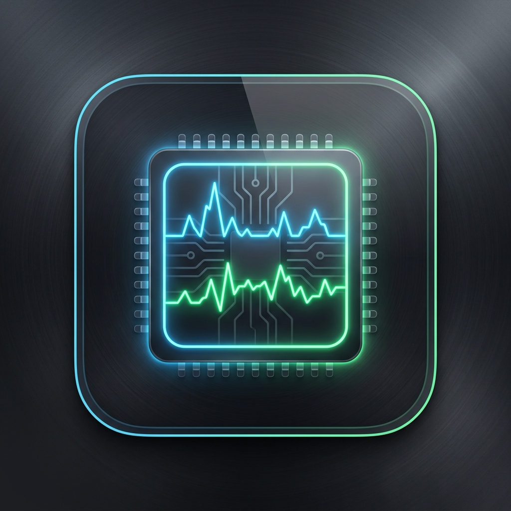

# rmeters

A lightweight, high-performance system monitor overlay for the Windows 11 taskbar, written in Rust. It provides real-time CPU and RAM load indicators positioned neatly on your taskbar, mimicking the look and feel of the classic xMeters utility.

**[Download Latest Release](https://github.com/andrewchuev/rmeters/releases/latest)**



## Features

- **Dual Display Modes**:
  - **Classic Mode**: Shows global CPU and RAM usage sparklines (rolling 60-second history).
  - **Per-Core Mode**: Shows individual CPU core usage vertical bars and a thick RAM progress bar (xMeters-style).
- **Native Taskbar Integration**: Bezelless popup overlay positioned next to the system tray, owned by `Shell_TrayWnd` to stay on top without flicker.
- **Right-Click Context Menu**: Right-click directly on the indicator panel to toggle display modes, configure autostart, open Settings, or exit — no separate tray icon needed.
- **No Dependencies**: Statically linked against the C runtime — runs on a clean Windows install without installing Visual C++ Redistributable.
- **Installer Included**: Ships with an Inno Setup installer (`rmeters-setup.exe`) that handles Start Menu shortcuts and optional autostart, as well as a portable zip for those who prefer no installation.
- **Zero Overhead**: Minimal CPU usage (~0%) and tiny RAM footprint (<12 MB) thanks to Rust and Direct2D hardware-accelerated rendering.
- **High-DPI Support**: Automatically scales layout, fonts, and graphics for any DPI scaling (100%, 150%, 200%, etc.).
- **Graceful Shutdown**: Handles standard console signals (Ctrl+C) and the Exit menu item cleanly.

## Installation

### Installer (recommended)

Download `rmeters-setup.exe` from the [latest release](https://github.com/andrewchuev/rmeters/releases/latest) and run it. The installer will:

- Place `rmeters.exe` in `%ProgramFiles%\RMeters`
- Create a Start Menu shortcut
- Optionally register rmeters to start with Windows
- Register an uninstaller in "Add or remove programs"

### Portable

Download `rmeters-windows-x64-portable.zip`, extract anywhere, and run `rmeters.exe` directly.

## Usage

Right-click on the overlay panel on your taskbar to access the context menu:

| Menu item | Description |
|---|---|
| Show CPU per Core | Toggle between classic sparkline and per-core bar modes |
| Start with Windows | Enable / disable autostart via the registry |
| Settings... | Open the settings window |
| Exit | Quit the application |

## System Requirements

- Windows 10 or Windows 11 (64-bit)
- No additional runtime libraries required

## Build from Source

```bash
# Development
cargo run

# Optimized release binary
cargo build --release
```

The compiled binary will be at `target/release/rmeters.exe`.

## How it Works

- **Metrics Collection**: Uses the `sysinfo` crate in a background thread to poll global/per-core CPU usage and memory stats every second.
- **Rendering**: Calls Windows **Direct2D** and **DirectWrite** for hardware-accelerated graphics and crisp text, drawn onto a layered window.
- **Positioning**: Hooks into tray area coordinates and repositions dynamically to fit seamlessly to the left of the system clock.
- **Layering**: The taskbar (`Shell_TrayWnd`) is the window owner, guaranteeing the overlay stays on top natively.
- **Mouse Input**: The overlay receives right-click events directly (`WM_RBUTTONUP`) while `WS_EX_NOACTIVATE` prevents it from stealing focus from other windows.
